# Reto LabCar

* **Sprint 3:**  Crea tu propia red social.  
* **Unidad 2:** No reinventes la rueda.  
* **Reto 1:** LabCar 

El reto consiste en recrear la página web LabCar responsive tanto para desktop y mobile.  

Este trabajo se dividió en 2 partes, se acoplan como uno solo y estan tanto en version movil como desktop además de contar con modales.

Fue necesario el aprendizaje sobre **Media Queries**, **Grid Sistem**, **Viewport**, **Responsive Web Designe**  y **Bootstrap** para resolver este reto.

## Primera Parte: (Ana) 

1) BARRA DE NAVEGACION: 

* DESKTOP: El logo principal de la página se encuentra del lado izquierdo y los botones de navegacion (Viaja, Conduce e Inicia sesión) se encuentran de lado derecho.

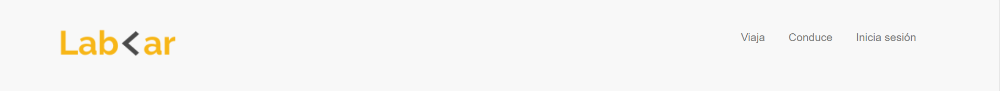

* MOVIL: El ícono de barra de navegación se encuentra del lado izquierdo; es un boton desplegable, por lo que al accionarlo se desplegarán las opciones vistas en la version de escritorio. El logo principal se ubicó en el centro de la barra de navegación.

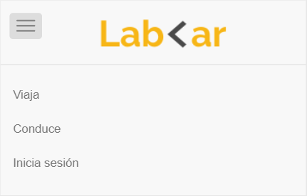

2) SECCIÓN 1 - REGISTRO

* DESKTOP: Se tiene una seccion con fondo de "taxi" y dentro esta un cuadro con dos botones de REGISTRO Y CONVIERTETE EN CONDUCTOR.

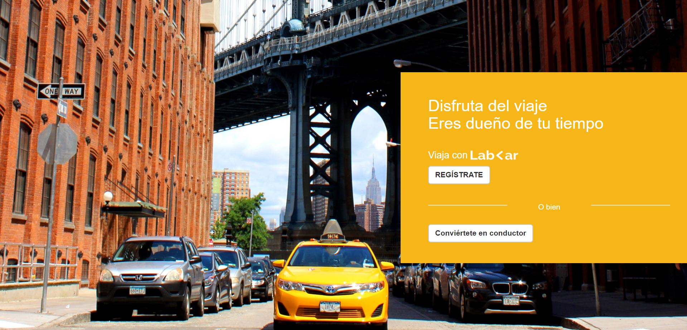

Al clickear el boton de registro aparecera el siguiente modal: 

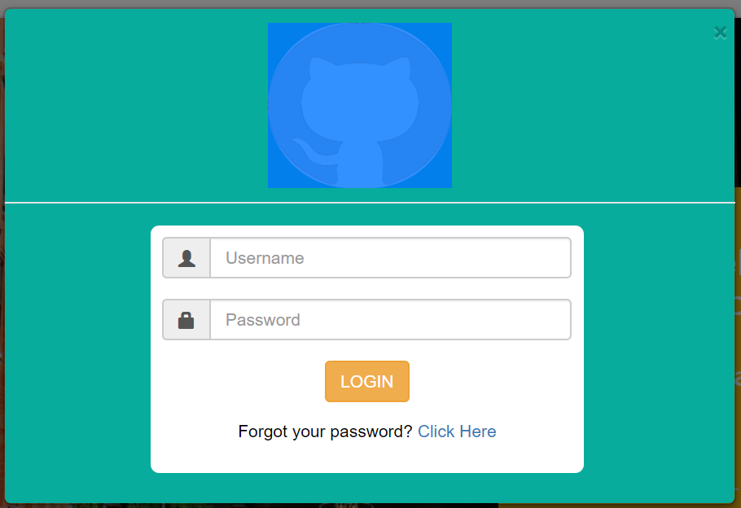

Al clickear el boton de Conviertete en conductor aparecera: 

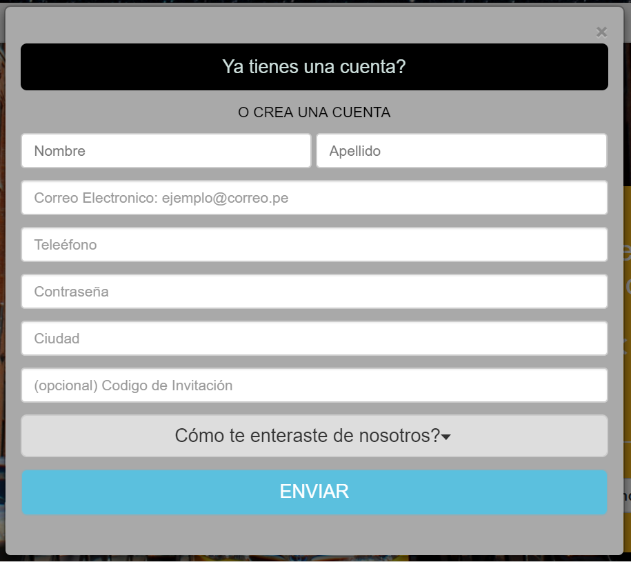

* MOVIL: Esta version tambien tiene un fondo de "taxi" y un cuadro con un boton: "descarga el app".

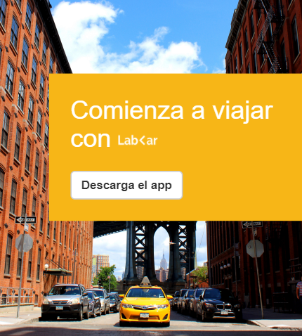

3) SECCIÓN 2 - NUEVA APP

* DESKTOP: Se muestra un cuadro en color amarillo con la imagen de un celular y una descripción que contienen un titulo y 2 párrafos.

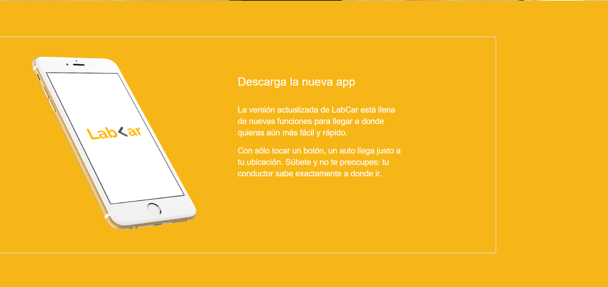

* MOVIL: Se muestra un contenedor en color amarillo con un titulo e imagen de un iphone.

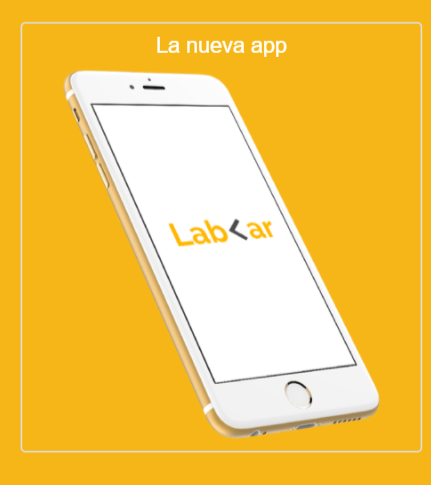

## Segunda Parte: (Alejandra)  

4) SECCIÓN 3 - CONDUCE CUANDO QUIERAS: 

* DESKTOP: Se observa una sección con un fondo de imagen, al lado derecho se muestra un texto y un botón el cual al realizar click se muestra un modal.

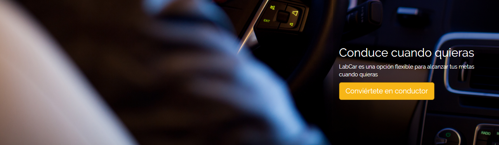  

* MODAL: Se muestra cuadro para inscripción cómo conductor.  

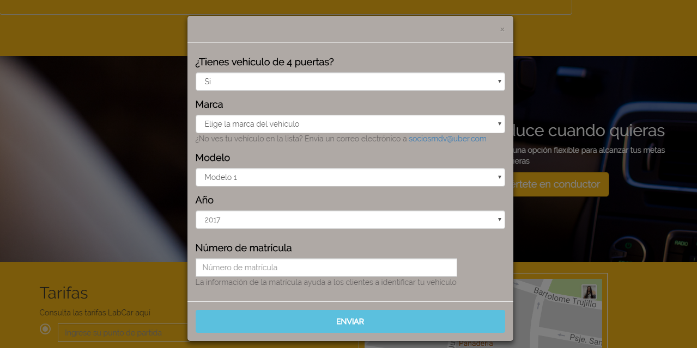

* MOVIL: El texto que se muestra al lado derecho en la versión mobile se muestra al centro.

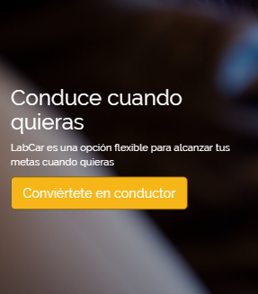  

* MODAL: Se muestra cuadro para inscripción cómo conductor.  

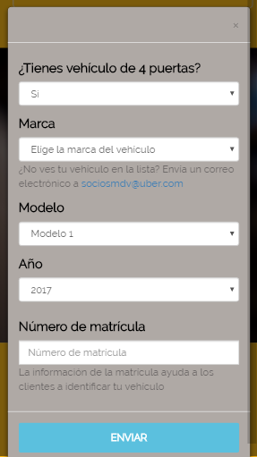  

5) SECCIÓN 4 - TARIFA Y MAPA:  

* DESKTOP: Se observa una sección conformada por dos partes, en el lado izquierdo se da la opción al usuario para consultar la tarifa y en el lado derecho se observa un mapa de google.

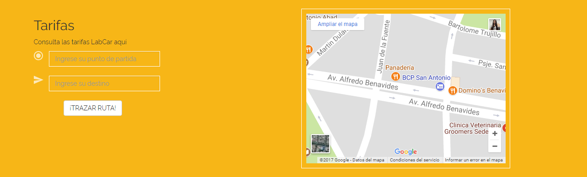  

* MOVIL: Ambas partes de la sección en la versión mobile son alineadas en una columna.

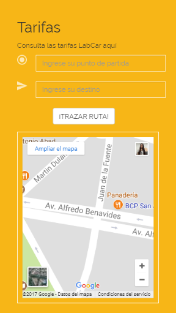  

6) SECCIÓN 5 - FOOTER:  

* DESKTOP: Parte final de la web, contiene íconos de redes sociles, links a diversas partes de la página y opciones de descarga.

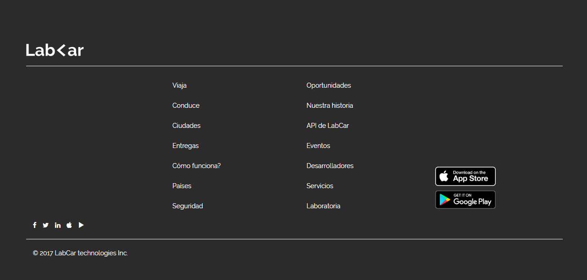  

* MOVIL

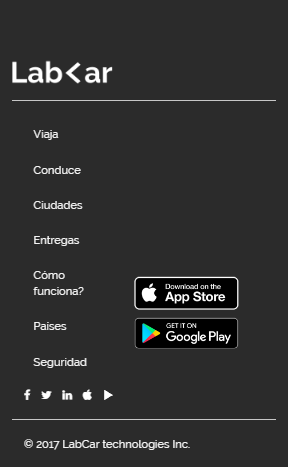  

## **Resultado**

**Vista Desktop**

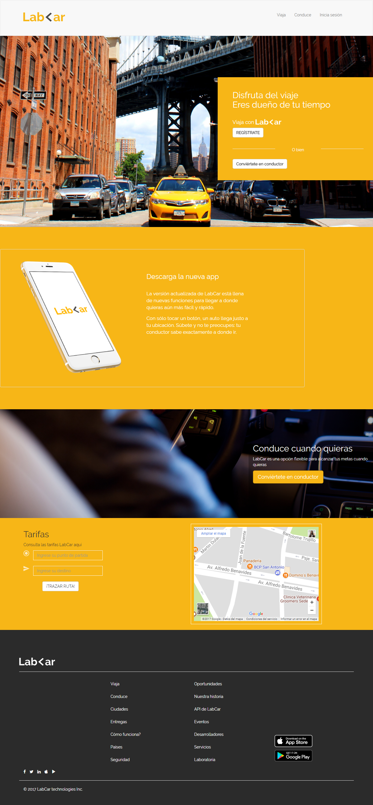

**Vista Mobile**

  

*Integrantes*

* Ana Lorena Diaz   
Github: <https://github.com/AnaLorenaDiaz>

* Alejandra Cabrera  
Github: <https://github.com/AlejandraCP>
