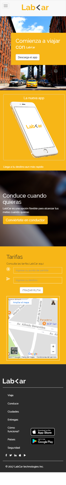

# Reto LabCar

* **Sprint 3:**  Crea tu propia red social.  
* **Unidad 2:** No reinventes la rueda.  
* **Reto 1:** LabCar 
 
El reto consiste en recrear la página web LabCar responsive tanto para desktop y mobile.  

Fue necesario el aprendizaje sobre **Media Queries**, **Grid Sistem**, **Viewport**, **Responsive Web Designe**  y **Bootstrap** para resolver este reto.

## **Desarrollo** 

Este reto fue realizado por dos personas, la división del trabajo fue por secciones de la páginas web, cada integrante debía realizar la sección correspondiente tanto para desktop y mobile.

## **Resultado**

**Vista Desktop**

**Vista Mobile**

  

*Integrantes*

* Ana Lorena Diaz   
Github: <https://github.com/AnaLorenaDiaz>

* Alejandra Cabrera  
Github: <https://github.com/AlejandraCP>
